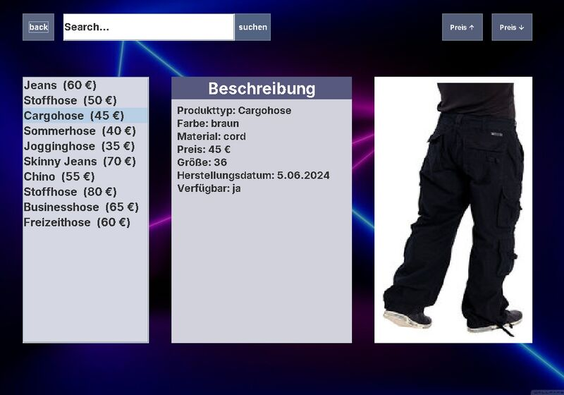

# theshamishop · Fashion Shop in Java

A desktop fashion shop app built with Java Swing.



## Features

- Welcome screen and category overview (tops, trousers, shoes, tracksuits, accessories)
- Product list per category with images and descriptions
- Search by product type, color or material (press Enter or click search)
- Sort by price, ascending and descending
- Product details with a matching picture for every category
- Custom background images

## Structure

| File | Purpose |
|---|---|
| `willkommensframe.java` | Welcome screen |
| `kategorien.java` | Category selection |
| `theshamishop.java` | Main shop window: list, search, sorting, product details |
| `shamishop.java` | Shop logic and product data |
| `Artikel.java` | Abstract base class with all shared product attributes |
| `Hosen.java`, `oberteile.java`, `schuhe.java`, `tracksuits.java`, `accessoires.java` | Product categories, each extends `Artikel` (inheritance) |
| `*.uml` | UML class diagrams |

## Run

```bash
javac -encoding UTF-8 *.java
java willkommensframe
```

The image files need to be in the same folder as the program.

## Built with

Java, Swing
